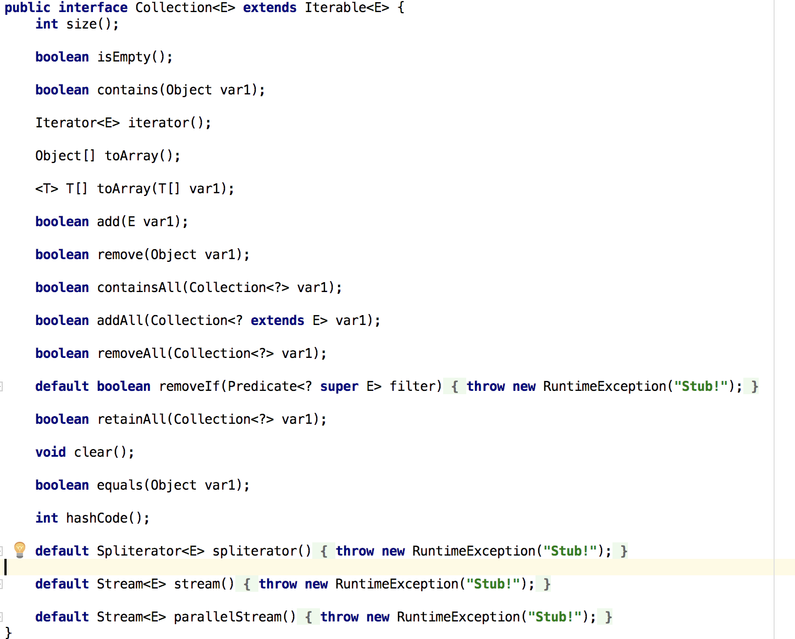

##Collection知识点记录
###Collection简介

1. `Collection`继承与`Iterable`迭代接口 
2. `Collection`有如下方法
3. `Collection`主要有两个子接口 `Set`，`List`
4. `Collection`中可以存储的元素间无序，可以重复组各 自独立的元素， 即其内的每个位置仅持有一个元素，同时允许有多个null元素对象。

-------
###1)List接口

1. `list`接口的特点是存储的元素实现类排序，而且可以重复存储相关员元素。
2. `list`接口拥有两个实现类 `ArrayList` , `LinkedList`

####1.1)ArrayList
1. `ArrayList`的特点是类似数组的形式进行存储，因此它的随机访问速度很快
2. `ArrayList`的缺点是不适合在线性表中间进行频繁的插入和删除操作，因为每次的插入和删除都会导致数组中元素的移动
3. 基于第二点，因为`ArrayList`数组长度的更改都是需要新建一个数组，然后Copy原数组进行更改，导致效率极低，开销大
4. 初始化`ArrayList`的时候如果没有指定长度，那么默认长度是10
5. `ArrayList`在增加新元素的时候，如果超过了原始的容量,`ArrayList`扩容`ensureCapacity`的方案是原始容量*3/2+1
6. `ArrayList`是非线程安全的，如果在多线程中使用`Vector`,它是线程安全的，并且使用和`ArrayList`相似，或者通过`Collections.synchronizedList(new ArrayList())`方法创建一个线程安全的`ArrayList`
7. `ArrayList`进行遍历的几种方式:for each 直接进行遍历、for循环进行遍历、通过迭代器`iterator`进行遍历

-------------
####1.2)LinkedList

1. 适合于频繁的在链表中间进行插入删除操作
2. 随机查找速度较慢，需要从头开始一个一个进行查询
3. `Linkedlist`内部是基于双向循环列表链表的结构来实现的。在`Linkedlist`内部拥有一个类似于C语言结构体的`Entry`内部类,在`Entry`的内部类中包含了前一个元素的地址引用和后一个元素的地址引用类似于c语言中指针。
4. `LinkedList`同样不是线程安全的，需要通过`Collection.synchronizedList(new LinkedList())`方法创建一个线程安全的`LinkedList`
5. `LinkedList`进行遍历的几种方式:for each 直接进行遍历、for循环进行遍历

--------

###Set接口

1. `Set`中不允许有重复的元素，只允许有一个null，

